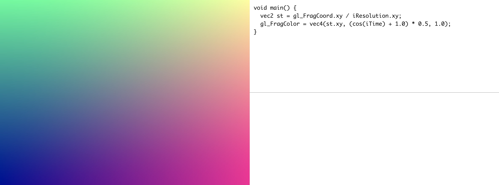

<br>

<p align="center">
  
</p>
<br>

<p align="center">
  <a href="https://github.com/vue-gl-fx/vue-gl-fx/">
    
  </a>
  <a href="https://www.npmjs.com/package/vue-gl-fx">
    
  </a>
</p>

<br>

<p align="center">
  <b>
    Created and Maintained by
    <a href="http://www.norbz.tech/">Nicolas Chesné</a>
    and 
    <a href="https://laurentgabarre.fr/">Laurent Gabarre</a>
  </b>
</p>

<br>

## Intro

- A simple WebGL components for accelerated 2D filter or effects. Can be used with Shadertoys codes

## Demo
A partially working playground can be found <a href="https://vue-gl-fx.github.io/vue-gl-fx" target="_blank">here</a>

## TODO
Heavily work in progress.
- Write docs
- stabilise texture input
- create demo page
- write npm publishing tasks

<br>

## Screenshots

<p align="center">
  
</p>

<br>

## Install and Usage

```bash
# install dependices
 `npm install`

# develop
`npm run dev`

# build component
`npm run build`

# build demo
`npm run build:demo`
```

<br>

## API

<details><summary><strong>Name a few APIs here</strong></summary>
<br>

1.  **`value`**: Number  
    Component's value binded, remember end with two `Tabs` every line

2.  **`on-when`**: Function  
    **params**: func ( ...param )  
    hook function when ...

<br/>
</details>

<details><summary><strong>Much more APIs</strong></summary>
<br>

1.  **`more`**: Boolean  
    **default**: `false`  
    ...

<br/>
</details>

<details><summary><strong>Categorize them</strong></summary>
<br>

1.  **`categorize`**: Object  
    ...

<br/>
</details>

<br>

## Other things such as Contribute guide / License / Thanks ...

> It's your turn
